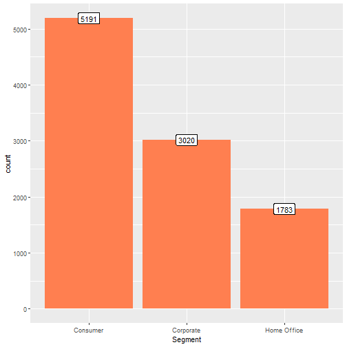

---

---
# The Sparks Foundation
## Task 4- Analysis of Superstore Data
### By Vidhi Gupta
output:pdf_document

```r
library(dplyr)
library(ggplot2)
library(magrittr)
library(knitr)
```
# Importing the dataset

```r
Superstore<-read.csv(file.choose(),header = T,sep=",",na.strings = "")
```


```r
dim(Superstore)
```

```
## [1] 9994   13
```

```r
str(Superstore)
```

```
## 'data.frame':	9994 obs. of  13 variables:
##  $ Ship.Mode   : chr  "Second Class" "Second Class" "Second Class" "Standard Class" ...
##  $ Segment     : chr  "Consumer" "Consumer" "Corporate" "Consumer" ...
##  $ Country     : chr  "United States" "United States" "United States" "United States" ...
##  $ City        : chr  "Henderson" "Henderson" "Los Angeles" "Fort Lauderdale" ...
##  $ State       : chr  "Kentucky" "Kentucky" "California" "Florida" ...
##  $ Postal.Code : int  42420 42420 90036 33311 33311 90032 90032 90032 90032 90032 ...
##  $ Region      : chr  "South" "South" "West" "South" ...
##  $ Category    : chr  "Furniture" "Furniture" "Office Supplies" "Furniture" ...
##  $ Sub.Category: chr  "Bookcases" "Chairs" "Labels" "Tables" ...
##  $ Sales       : num  262 731.9 14.6 957.6 22.4 ...
##  $ Quantity    : int  2 3 2 5 2 7 4 6 3 5 ...
##  $ Discount    : num  0 0 0 0.45 0.2 0 0 0.2 0.2 0 ...
##  $ Profit      : num  41.91 219.58 6.87 -383.03 2.52 ...
```


```r
head(Superstore,10)
```

```
##         Ship.Mode   Segment       Country            City      State Postal.Code Region        Category
## 1    Second Class  Consumer United States       Henderson   Kentucky       42420  South       Furniture
## 2    Second Class  Consumer United States       Henderson   Kentucky       42420  South       Furniture
## 3    Second Class Corporate United States     Los Angeles California       90036   West Office Supplies
## 4  Standard Class  Consumer United States Fort Lauderdale    Florida       33311  South       Furniture
## 5  Standard Class  Consumer United States Fort Lauderdale    Florida       33311  South Office Supplies
## 6  Standard Class  Consumer United States     Los Angeles California       90032   West       Furniture
## 7  Standard Class  Consumer United States     Los Angeles California       90032   West Office Supplies
## 8  Standard Class  Consumer United States     Los Angeles California       90032   West      Technology
## 9  Standard Class  Consumer United States     Los Angeles California       90032   West Office Supplies
## 10 Standard Class  Consumer United States     Los Angeles California       90032   West Office Supplies
##    Sub.Category    Sales Quantity Discount    Profit
## 1     Bookcases 261.9600        2     0.00   41.9136
## 2        Chairs 731.9400        3     0.00  219.5820
## 3        Labels  14.6200        2     0.00    6.8714
## 4        Tables 957.5775        5     0.45 -383.0310
## 5       Storage  22.3680        2     0.20    2.5164
## 6   Furnishings  48.8600        7     0.00   14.1694
## 7           Art   7.2800        4     0.00    1.9656
## 8        Phones 907.1520        6     0.20   90.7152
## 9       Binders  18.5040        3     0.20    5.7825
## 10   Appliances 114.9000        5     0.00   34.4700
```

```r
summary(Superstore)
```

```
##   Ship.Mode           Segment            Country              City              State          
##  Length:9994        Length:9994        Length:9994        Length:9994        Length:9994       
##  Class :character   Class :character   Class :character   Class :character   Class :character  
##  Mode  :character   Mode  :character   Mode  :character   Mode  :character   Mode  :character  
##                                                                                                
##                                                                                                
##                                                                                                
##   Postal.Code       Region            Category         Sub.Category           Sales              Quantity    
##  Min.   : 1040   Length:9994        Length:9994        Length:9994        Min.   :    0.444   Min.   : 1.00  
##  1st Qu.:23223   Class :character   Class :character   Class :character   1st Qu.:   17.280   1st Qu.: 2.00  
##  Median :56431   Mode  :character   Mode  :character   Mode  :character   Median :   54.490   Median : 3.00  
##  Mean   :55190                                                            Mean   :  229.858   Mean   : 3.79  
##  3rd Qu.:90008                                                            3rd Qu.:  209.940   3rd Qu.: 5.00  
##  Max.   :99301                                                            Max.   :22638.480   Max.   :14.00  
##     Discount          Profit         
##  Min.   :0.0000   Min.   :-6599.978  
##  1st Qu.:0.0000   1st Qu.:    1.729  
##  Median :0.2000   Median :    8.666  
##  Mean   :0.1562   Mean   :   28.657  
##  3rd Qu.:0.2000   3rd Qu.:   29.364  
##  Max.   :0.8000   Max.   : 8399.976
```


```r
#Check missing values in the data.
sapply(Superstore,function(x)sum(is.na(x)))
```

```
##    Ship.Mode      Segment      Country         City        State  Postal.Code       Region     Category 
##            0            0            0            0            0            0            0            0 
## Sub.Category        Sales     Quantity     Discount       Profit 
##            0            0            0            0            0
```
There are no missing values in this data.

## Exploratory Data Analysis

```r
ggplot(Superstore,aes(Profit))+geom_histogram(fill="coral",bins = 100)
```


```r
#Relationship between Sales and Profit
ggplot(Superstore,aes(Sales,Profit))+geom_point(color="coral")+xlab("Sales")+ylab("Profit")+ggtitle("Sales vs Profit")
```


### Univariate Analysis

```r
#Ship Mode
ggplot(Superstore,aes(Ship.Mode))+geom_bar(stat="count",fill="pink")
```


```r
#Segment
Superstore %>% group_by(Segment) %>% summarise(count=n()) %>% ggplot(aes(Segment,count))+geom_bar(stat = "identity",fill="coral")+geom_label(aes(Segment,count,label=count))
```



```r
#Category
Superstore %>% group_by(Category) %>% summarise(count=n()) %>% ggplot(aes(Category,count))+geom_bar(stat = "identity",fill="coral")+geom_label(aes(Category,count,label=count))
```


```r
#Sub-Category
Superstore %>% group_by(Sub.Category) %>% summarise(count=n()) %>% ggplot(aes(Sub.Category,count))+geom_bar(stat = "identity",fill="coral")+geom_label(aes(Sub.Category,count,label=count))+theme(axis.text.x=element_text(angle = 45,hjust=1))
```


```r
#Region
Superstore %>% group_by(Region) %>% summarise(count=n()) %>% ggplot(aes(Region,count))+geom_bar(stat = "identity",fill="coral")+geom_label(aes(Region,count,label=count))
```


```r
#Segment & Category basis region
ggplot(Superstore,aes(Category,fill=Region))+geom_bar(stat = "count",position = "dodge")+facet_grid(.~ Segment)+theme(axis.text.x=element_text(angle = 45,hjust=1))
```


```r
#Region basis Ship.Mode
ggplot(Superstore,aes(Region,fill=Ship.Mode))+geom_bar(stat = "count",position = "dodge")
```


It is clearly evident that the highest number of transactions have the following features:
Shipping mode- Standard Class,  
Segment- Consumer,  
Category- Office Supplies,  
Region- West

### Bivariate Analysis


```r
 #Relationship between discount and profit
ggplot(Superstore,aes(Discount,Profit))+geom_point(color="coral")+xlab("Discount")+ylab("Profit")+ggtitle("Discount vs Profit")
```


```r
#Relationship between discount and Sales
ggplot(Superstore,aes(Discount,Sales))+geom_point(color="coral")+xlab("Discount")+ylab("Sales")+ggtitle("Discount vs Sales")
```


```r
#We will see the impact of discount on Sales and Profit
ggplot(Superstore,aes(Sales,Profit))+geom_point(aes(color=Discount))+xlab("Sales")+ylab("Profit")+ggtitle("Sales vs Profit")+labs(caption = "Colour showing levels of discount")
```


```r
#Quantity Sold vs Profit
ggplot(Superstore,aes(Quantity,Profit))+geom_point(color="coral")+xlab("Quantity")+ylab("Profit")+ggtitle("Quantity vs Profit")
```


Inferences drawn:
We can clearly observe that low levels of discount lead to more profitable sales.As the amount of discount increases, we start incurring losses.


```r
#State vs Profit
Superstore %>% group_by(State) %>% summarise(Profit=sum(Profit))  %>% ggplot(aes(State,Profit))+geom_bar(stat = "identity",fill="coral")+ggtitle("State vs Profit")+theme(axis.text.x=element_text(angle = 45,hjust=1,size = 5.5,face = "bold"))
```


```r
Superstore %>% group_by(State) %>% summarise(Sales=sum(Sales))  %>% ggplot(aes(State,Sales))+geom_bar(stat = "identity",fill="coral")+ggtitle("State vs Sales")+theme(axis.text.x=element_text(angle = 45,hjust=1,size = 5.5,face = "bold"))
```


```r
#Region vs Profit
Superstore %>% group_by(Region) %>% summarise(Profit=sum(Profit))  %>% ggplot(aes(Region,Profit))+geom_bar(stat = "identity",fill="coral")+ggtitle("Region vs Profit")
```


```r
#Profit basis State and Region
Superstore %>% group_by(State,Region) %>% summarise(Profit=sum(Profit))  %>% ggplot(aes(State,Profit))+geom_bar(stat = "identity",aes(fill=Region))+ggtitle("State vs Profit")+theme(axis.text.x=element_text(angle = 45,hjust=1,size = 5.5,face = "bold"))
```


```r
#Ship mode vs Profit
Superstore %>% group_by(Ship.Mode) %>% summarise(Profit=sum(Profit))  %>% ggplot(aes(Ship.Mode,Profit))+geom_bar(stat = "identity",fill="coral")+ggtitle("Shipping Mode vs Profit")
```


```r
#Segment vs Profit
ggplot(Superstore,aes(Segment,Profit))+geom_boxplot(aes(fill=Segment),color="blue")+ggtitle("Segment vs Profit")
```


```r
Superstore %>% group_by(Segment) %>% summarise(Profit=sum(Profit))  %>% ggplot(aes(Segment,Profit))+geom_bar(stat = "identity",fill="coral")+ggtitle("Segment vs Profit")
```


```r
#Category vs Profit
ggplot(Superstore,aes(Category,Profit))+geom_boxplot(aes(fill=Category),color="blue")+ggtitle("Category vs Profit")
```


```r
Superstore %>% group_by(Category) %>% summarise(Profit=sum(Profit))  %>% ggplot(aes(Category,Profit))+geom_bar(stat = "identity",fill="coral")+ggtitle("Category vs Profit")
```


```r
#Sub-Category vs Profit
Superstore %>% group_by(Category,Sub.Category) %>% summarise(Profit=sum(Profit))  %>% ggplot(aes(Sub.Category,Profit))+geom_bar(stat = "identity",aes(fill=Category))+ggtitle("Sub-Category vs Profit")+theme(axis.text.x=element_text(angle = 45,hjust=1,size = 5.5,face = "bold"))
```


```r
Superstore %>% group_by(Category,Sub.Category) %>% summarise(Quantity=sum(Quantity))  %>% ggplot(aes(Sub.Category,Quantity))+geom_bar(stat = "identity",aes(fill=Category))+ggtitle("Sub-Category vs Quantity Sold")+theme(axis.text.x=element_text(angle = 45,hjust=1,size = 5.5,face = "bold"))
```


### INSIGHTS:
1.Standard Shipping is the most profitable Shipping Mode in all the Categories whereas same day shipping mode is the least profitable.  
2.Profit earned and Quantity sold is highest in the Consumers segment followed by Corporate and Home Offices segments.  
3.Highest Profits observed in the state of California(West) followed by New York(East). On the other hand, the states of Texas(Central), Pensylvania(East) and Ohio(East) incurred the highest amount of loss.  
4.Maximum profit observed in the West Region and minimum in the Central Region.  
5.Office supplies is the best- selling category. However, profits earned is highest among the technology sector.  
6.	Although Copiers is the least selling sub-category but has given the highest profit out of all the sub-categories.  
7.The products sold in the:  
a.Furnishing Category: Maximum was Furnishings, Minimum was Bookcases  
b.Office Supplies: Maximum was Binders, Minimum was Tables  
c.Technology: Maximum was Phones, Minimum was Copier.  
7.Losses are observed from the sale of tables(Furniture), Bookcases(Furniture) and Supplies(Office Supplies).  
8.Negative Correlation between Discount and Profit. Profit and Sales are observed to be high with low levels of discount. As the amount of discount increases, we start incurring losses.  

### KEY AREAS FOR IMPROVEMENT:
1 .Improvements to be made to drive sales in same day shipping mode.  
2. Work on improving Volume of Sales and Profit in the South Region of US and other states of US other than California and New York.  
3. To increase production of Copiers and Sales too by advertising in order to earn high profits.  
4. Major loss in business attribute to Furniture Sales. Hence, Cost of production should be decreased or Price should be increased. Alternatively, company should switch to producing other profitable goods.  


